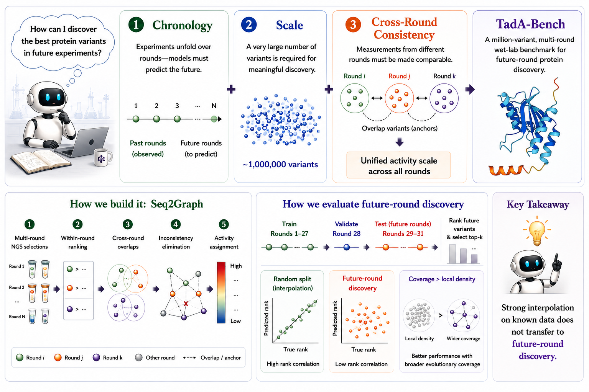

<h1 align="center">TadA-Bench</h1>

<p align="center">
  <strong>A Million-Variant Benchmark for Future-Round Discovery Toward Agentic Protein Engineering</strong>
</p>

<p align="center">
  <a href="https://arxiv.org/abs/2606.02624"></a>
  <a href="https://tada-bench.github.io/"></a>
  <a href="https://icml.cc/Conferences/2026"></a>
  <a href="https://huggingface.co/datasets/JinGao/TadA-Bench"></a>
  <a href="https://www.apache.org/licenses/LICENSE-2.0"></a>
</p>

<p align="center">
  <a href="https://jingao.online/">Jin Gao</a><sup>1</sup>,
  <a href="https://juntuzhao.run/">Juntu Zhao</a><sup>1</sup>,
  <a href="https://github.com/zzrddq123">Zirui Zeng</a><sup>1</sup>,
  <a href="https://scholar.google.com/citations?user=345MnaEAAAAJ&amp;hl=en">Jiaqi Shen</a><sup>1</sup>,
  <a href="https://openreview.net/profile?id=~Junhao_Shi4">Junhao Shi</a><sup>1</sup>,
  <a href="https://openreview.net/profile?id=~Dukun_Zhao1">Dukun Zhao</a><sup>1</sup>,
  <a href="https://www.agri.sjtu.edu.cn/En/Data/View/9939">Yuming Lu</a><sup>1,&dagger;</sup>,
  <a href="https://dequan.wang/">Dequan Wang</a><sup>1,2,&dagger;</sup>
</p>

<p align="center">
  <sup>1</sup>Shanghai Jiao Tong University &nbsp; · &nbsp;
  <sup>2</sup>Shanghai Innovation Institute<br>
  <sup>&dagger;</sup>Corresponding authors
</p>

<p align="center">
  <a href="https://tada-bench.github.io/">Project</a> ·
  <a href="https://arxiv.org/abs/2606.02624">Paper</a> ·
  <a href="https://huggingface.co/datasets/JinGao/TadA-Bench">Dataset</a> ·
  <a href="LEADERBOARD.md">Leaderboard Policy</a>
</p>

<p align="center">
  
</p>

AI for scientific discovery is moving from fitting retrospective assay tables
toward agentic protein-engineering workflows that must decide which variants to
test next. TadA-Bench turns 31 wet-lab rounds of TadA directed evolution into a
fixed-data, million-variant replay benchmark: biological language models use
earlier evidence to rank variants appearing only in later rounds. With aligned
DNA, RNA, and protein views plus Seq2Graph activity labels, it targets
past-to-future candidate prioritization that random-split interpolation can hide.

## News

- **2026-05** TadA-Bench was accepted at **ICML 2026** and released on
  [arXiv](https://arxiv.org/abs/2606.02624).

## Overview

TadA-Bench is designed around three benchmark requirements:

- **Chronological replay**: models train on observed rounds, validate on an
  intermediate round, and rank held-out future-round variants.
- **Million-scale coverage**: the public dataset provides aligned DNA, RNA, and
  protein views for the same TadA engineering campaign.
- **Cross-round consistency**: Seq2Graph uses within-round rankings and overlap
  anchors to build a shared activity scale across noisy multi-round NGS
  selections.

The repository provides fixed-split loaders, baseline configs, leaderboard
validation, and reproducibility checks for future-round discovery experiments.

## Dataset

Load the benchmark with `datasets`:

```python
from datasets import load_dataset

ds = load_dataset(
    "JinGao/TadA-Bench",
    revision="07168448caaafab4efb26eca04ec3e503edf1c04",
)
print(ds)
```

Use the fixed Hugging Face splits for official comparisons:

```text
all.AA.train, all.AA.val, all.AA.test
all.DNA.train, all.DNA.val, all.DNA.test
all.RNA.train, all.RNA.val, all.RNA.test
```

Leaderboard results should use these splits without reshuffling.
Official ICML 2026 results use Hugging Face dataset revision
`07168448caaafab4efb26eca04ec3e503edf1c04`.

## Installation

Install [uv](https://docs.astral.sh/uv/) and sync the environment:

```bash
uv sync
```

Optional cache locations:

```bash
export HF_HOME="$HOME/.cache/huggingface"
export HF_DATASETS_CACHE="$HF_HOME/datasets"
export HF_HUB_DISABLE_XET=1
export TORCH_HOME="$HOME/.cache/torch"
```

## Baselines

The repository includes representative MLP-head baseline configs for protein and
DNA views. The dataset also provides aligned RNA splits; RNA model configs can be
added following the same template.
Run a quick smoke check first:

```bash
uv run python scripts/run.py --cfg_path config/smoke/TadABench_future_round_MLP_ESM2-35M_smoke.py
uv run python scripts/run.py --cfg_path config/smoke/TadABench_future_round_MLP_Carbon-500M_smoke.py
```

Full baseline configs:

```bash
mkdir -p predictions results/metrics logs
uv run python scripts/run.py --cfg_path config/TadABench_future_round_MLP_ESM2-35M.py
uv run python scripts/run.py --cfg_path config/TadABench_future_round_MLP_ESMC-300M.py
uv run python scripts/run.py --cfg_path config/TadABench_future_round_MLP_NT-50M.py
uv run python scripts/run.py --cfg_path config/TadABench_future_round_MLP_Carbon-500M.py
```

Carbon-500M formal MLP runs should use the generated seed configs. Each config
preserves the three learning rates from the public baseline setting, and the
validation split should be used for hyperparameter selection:

```bash
for seed in 1 2 3; do
  uv run python scripts/run.py \
    --cfg_path config/generated_carbon/TadABench_future_round_MLP_Carbon-500M_seed${seed}.py
done
uv run python scripts/summarize_carbon_results.py --strict
```

Carbon zero-shot base-pair likelihood scoring can be run separately. Passing
`--repeat` records audit metadata and, when `--run_id` is omitted, adds the
repeat number to the output file names:

```bash
for repeat in 1 2 3; do
  uv run python scripts/run_carbon_likelihood.py \
    --model_name HuggingFaceBio/Carbon-500M \
    --revision fns \
    --splits val test \
    --repeat ${repeat}
done
uv run python scripts/summarize_carbon_results.py --strict
```

Additional smoke configs are available under `config/smoke/` for quick
end-to-end checks. Full runs write prediction CSVs under
`predictions/future_round/` and metric JSON files under
`results/metrics/future_round/`.

On Blackwell GPUs such as RTX 5080 (`sm_120`), ensure the active environment has
a PyTorch build that supports the device before launching Carbon runs. If the
locked environment reports `no kernel image is available for execution on the
device`, upgrade the active venv's PyTorch build and run through the venv Python
directly, or refresh the project lock for that hardware.

After a successful full run, expect files named like:

```text
predictions/future_round/<resolved_run_id>_val.csv
predictions/future_round/<resolved_run_id>_test.csv
results/metrics/future_round/<resolved_run_id>_val.json
results/metrics/future_round/<resolved_run_id>_test.json
```

Prediction CSV columns:

```text
sequence,y_true,y_pred,split,domain,run_id,model,modality,example_index,config_path,git_commit,seed,repeat,revision,protocol,max_samples,is_subset
```

Metric JSON files include `run_id`, `model`, `modality`,
`hyperparameter_id`, `hyperparameters`, `split`, `num_examples`, `metrics`,
`config_path`, `git_commit`, and `epoch`. Carbon runs also include repeat/seed
or model-revision fields when available.

## Leaderboard Submissions

Submit one CSV per modality and split. The CSV must include:

```text
sequence,prediction,method_name
```

Recommended extra columns:

```text
model_family,code_url,commit_hash,notes
```

Metadata should follow `schemas/leaderboard_submission_schema.json`. Required
metadata fields are:

```text
method_name
modality
split
prediction_csv
code_url
uses_tadabench_train_only
external_data
test_labels_used_for_training
contact
```

Submissions that used test labels for training are not allowed. If
`uses_tadabench_train_only` is `false`, `external_data` must describe the data
sources used.

Validate the example format without downloading a full split:

```bash
uv run python scripts/validate_leaderboard_submission.py \
  --submission examples/example_leaderboard_submission.csv \
  --metadata_json examples/example_leaderboard_metadata.json \
  --schema_json schemas/leaderboard_submission_schema.json \
  --format_only
```

Validate a full-split submission locally:

```bash
uv run python scripts/validate_leaderboard_submission.py \
  --submission path/to/submission.csv \
  --metadata_json path/to/metadata.json \
  --schema_json schemas/leaderboard_submission_schema.json \
  --dataset JinGao/TadA-Bench \
  --dataset_revision 07168448caaafab4efb26eca04ec3e503edf1c04 \
  --seq_type AA \
  --split test \
  --out_json results/leaderboard_validation/example.json
```

The validator reports Spearman, Recall@10%, and nDCG@10%. The files in
`examples/` are format examples; full validation requires predictions for every
sequence in the selected fixed split and rejects duplicate, missing, and extra
sequences.

See [LEADERBOARD.md](LEADERBOARD.md) for the leaderboard policy and validation
details.

## Citation

If you use TadA-Bench, please cite the accompanying ICML 2026 paper:
[arXiv:2606.02624](https://arxiv.org/abs/2606.02624).

```bibtex
@inproceedings{gao2026tadabench,
  title = {TadA-Bench: A Million-Variant Benchmark for Future-Round Discovery Toward Agentic Protein Engineering},
  author = {Gao, Jin and Zhao, Juntu and Zeng, Zirui and Shen, Jiaqi and Shi, Junhao and Zhao, Dukun and Lu, Yuming and Wang, Dequan},
  booktitle = {Proceedings of the 43rd International Conference on Machine Learning},
  year = {2026}
}
```

## License

This project is licensed under the
[Apache License 2.0](https://www.apache.org/licenses/LICENSE-2.0). The Hugging
Face dataset [`JinGao/TadA-Bench`](https://huggingface.co/datasets/JinGao/TadA-Bench)
is also released under Apache-2.0.

## Contact

Jin Gao: [Homepage](https://jingao.online/) | [gaojin@sjtu.edu.cn](mailto:gaojin@sjtu.edu.cn)
